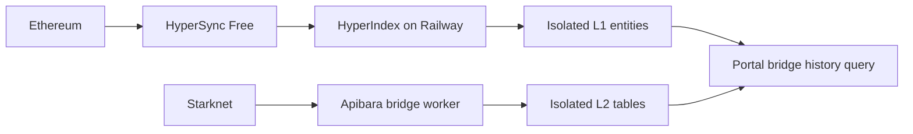

# L1 bridge migration to HyperIndex on Railway

Implementation and rollout plan, based on repository code and Envio documentation checked on 30 September 2026. Both mainnet shadow workers are deployed in RW_Indexer/main and have passed replay, history comparison and deployed restart checks. Portal reader cutover remains pending.

## Implementation status — 30 September 2026

- Implemented `@realms-world/hyperindex` on pinned Envio **3.12.1** with both network configs, the four filtered handlers, rollback-managed events, Railway Docker/bootstrap configuration, and a session writer lock.
- Implemented `@realms-world/bridge` normalization, isolated L2 storage/replay, a single-snapshot SQL reader, and portal status/action handling. The portal reader remains on `BRIDGE_HISTORY_SOURCE=legacy`. The new shadow L2 service explicitly uses isolated storage; existing services retain their original targets.
- Handler/config tests, normalization tests, database typecheck, portal tests/build, changed-file lint, and the real Apibara/PGlite rollback suite pass. Disposable PostgreSQL tests verify writer exclusion, lock loss/reacquisition, and the pinned Envio persistence API: checkpoint rollback, replacement evidence, eventless progress, storage reopen, and preservation of another schema. Staged Envio handler loading passes. These checks do not prove a full HyperSync source reorg across process downtime.
- CI now has a separate Node 22 HyperIndex job, disposable PostgreSQL lock and Envio storage tests, and a Docker image build. Both Docker images built successfully on Railway. Local Docker execution is unavailable; the CI job repeats container builds and isolated database checks. Full application typecheck still reports errors outside the modified files; the changed files typecheck cleanly.
- Required cutover checks: real chain samples and Free-token access, deployed image startup, restricted database grants, completed shadow replay, representative L1/L2 history comparisons, one deployed restart/resume, and sustained acceptable lag/throttling with stale-data handling. A custom source-fork/crash harness and a fixed 48-hour soak are additional assurance rather than mandatory blockers. Keep legacy recovery assets during the initial observation period.

Operator instructions are in [the Railway runbook](../packages/hyperindex/README.md); the reviewed L2 bootstrap is in [the SQL directory](../packages/db/sql/README.md). Select a validated rebuild using server-only `BRIDGE_HISTORY_L1_SCHEMA`; it accepts the selected network's base schema and a restricted suffix. Mainnet and Sepolia isolated L2 workers **must use separate databases**, with one bridge writer per database, because the pinned Apibara plugin uses table-wide rollback triggers. Stop the previous isolated L2 worker before starting its replacement.

Replace the Ethereum Apibara indexer with HyperIndex v3, run the worker on Railway, and use HyperSync Free for historical and live data. Keep Starknet indexing on Apibara. Use HyperIndex-managed entities so its reorg rollback covers every L1 write, and combine L1 and L2 data when the portal reads bridge history.

HyperSync Free is the selected data plan. It currently has fair-use throttling and is described as suitable for development and experiments; this is not a promise of free production capacity or an SLA. Measure this workload on the free token and record any account restrictions before cutover. No paid upgrade, overage, or RPC fallback is part of this plan. Railway and database resource costs remain. See [HyperSync pricing](https://envio.dev/pricing/hypersync) and the [HyperIndex overview](https://docs.envio.dev/docs/HyperIndex/overview).

## Scope and existing behavior

There is one active L1 indexer in this repository: `packages/apibara/indexers/eth-realms-bridge.indexer.ts`. It handles the Realms NFT bridge through events emitted by the Starknet messaging contract. This migration does not add LORDS bridge or ERC721 transfer indexing.

| Network | Chain ID | Messaging contract                           | Realms L1 bridge filter                      | Inclusive L1 start block |
| ------- | -------- | -------------------------------------------- | -------------------------------------------- | ------------------------ |
| Mainnet | 1        | `0xc662c410C0ECf747543f5bA90660f6ABeBD9C8c4` | `0xA425Fa1678f7A5DaFe775bEa3F225c4129cdbD25` | 20,433,152               |
| Sepolia | 11155111 | `0xe2bb56ee936fd6433dc0f6e7e3b8365c906aa057` | `0x345Eaf46F42228670489B47764b0Bd21f2141bd1` | 6,180,467                |

The corresponding Realms L2 bridges are:

- Mainnet: `0x013ae4e41ff29ee8311c84b024ac59a0c13f73fa1ba0cea02fbbf7880ec4835a`.
- Sepolia: `0x0467f6b080db9734b8b0a2ccb7fd020914e47f2f62aa668f56c4124946e4eb70`.

Addresses come from `packages/constants/src/bridge-addresses.ts`. Preserve the exact existing indexed-parameter filters initially:

| Event                 | Indexed parameters to match                                      | Current portal event type |
| --------------------- | ---------------------------------------------------------------- | ------------------------- |
| `LogMessageToL2`      | `fromAddress = L1 bridge`; destination and selector unrestricted | `deposit_initiated_l1`    |
| `ConsumedMessageToL2` | `fromAddress = L1 bridge`, `toAddress = L2 bridge`               | `withdraw_completed_l2`   |
| `LogMessageToL1`      | `fromAddress = L2 bridge`, `toAddress = L1 bridge`               | `withdraw_available_l1`   |
| `ConsumedMessageToL1` | `fromAddress = L2 bridge`, `toAddress = L1 bridge`               | `withdraw_completed_l1`   |

The first filter is broader than the others today. Do not silently tighten it during migration; verify captured payloads and treat any filter change as a separately explained correction.

The current L1 indexer processes `accepted` blocks. Its Starknet counterpart, `strk-realms-bridge.indexer.ts`, processes `pending` data and writes to the same `realms_bridge_requests` and `realms_bridge_events` tables. The portal reads these through `apps/account-portal/src/lib/getBridgeTransactions.ts` and polls every 10 seconds.

## Storage and read architecture

Run the new worker on Railway but initially reuse the existing PostgreSQL database, subject to a connection and schema-isolation test. The repository uses Neon-specific application clients, so moving the database to Railway is a separate migration, not a prerequisite here. HyperIndex should connect with ordinary PostgreSQL credentials and the provider's required TLS settings.

Proposed data flow:

Use a dedicated PostgreSQL schema such as `hyperindex_l1_mainnet`, and a separate schema/database for Sepolia. HyperIndex exclusively owns the L1 schema and its migration, checkpoint, and rollback tables. Verify the pinned version's internal table placement as well as entity table placement; `ENVIO_PG_SCHEMA` alone is not proof that all metadata is isolated.

Use `context.Entity.set/get` for all L1 state. Do not call the current Drizzle client from HyperIndex handlers, and do not copy live L1 records into the old tables with an append-only sync job. Those writes would be outside HyperIndex's rollback boundary. The framework's handlers can run during both preload and processing, which is another reason to keep external writes out. See [event handlers](https://docs.envio.dev/docs/HyperIndex/event-handlers) and [reorg support](https://docs.envio.dev/docs/HyperIndex/reorgs-support).

### Isolate the existing Starknet bridge data

Create new L2-only bridge request/event tables using the existing Drizzle approach. Adapt only the Starknet bridge indexer's storage targets and shared normalization, leaving its framework and other Starknet indexers in place. Replay it under a new indexer name/checkpoint into those tables. Preserve the existing starting cursors, mainnet `664161` and Sepolia `76103`, including Apibara's cursor semantics.

This L2 storage change isolates ownership because the legacy event rows do not record their source chain. In particular, `withdraw_completed_l2` can originate from either the L1 messaging event or the Starknet completion event. Filtering legacy rows by event type cannot reliably separate ownership. Replaying into a clean L2 destination avoids guessed provenance and lets each framework undo only its own writes. Keep the old tables untouched for comparison and rollback.

### Entity and identity design

Create a HyperIndex `L1BridgeEvent` entity for each matching log, with:

- An event ID containing Ethereum chain ID, block hash, transaction hash, and log index.
- Block number, block hash, timestamp, transaction hash, log index, event name, and physical source chain.
- Logical request key, direction, decimal request hash, explicit `ownerL1` and `ownerL2`, token IDs, and original payload elements as lossless decimal strings.
- The compatible portal status type from the event mapping above.

Start with event entities as the source of truth; derive requests from the small filtered event set rather than maintaining another mutable L1 aggregate. Add indexes for request key, owners, and ordering used by the portal. Verify generated SQL types and names before defining read-only Drizzle mappings. HyperIndex owns their DDL; exclude them from Drizzle migration generation. See [entity schemas](https://docs.envio.dev/docs/HyperIndex/schema).

Define one pure normalization module shared by the L1 handler, L2 bridge handler, and read adapter. The logical key should include network pair, bridge route, direction, and decimal request hash. Validate that records with the same key agree on owners and token IDs. Event identity and request identity are separate concepts.

Resolve these observed compatibility issues using real-event fixtures:

- L1 currently passes an array to the text `_id` field, while L2 explicitly builds a colon-separated ID. Do not assume their persisted forms match.
- Payload positions 2 and 3 represent L1 and L2 owners; logical sender and recipient depend on direction. The existing L1 code always assigns them to `from_address` and `to_address` in that order, while the L2 withdrawal code reverses them.
- Keep request hashes, payload limbs, and token IDs lossless. Only convert token IDs to the UI's `number[]` after validating its supported integer range.
- Preserve existing status strings initially, including the name `withdraw_completed_l2`, but keep physical source chain separately for provenance and explorer links.

The portal's new read adapter should merge only the isolated L1 and L2 sources, with explicit network filtering and wallet address normalization. Return the current bridge-history shape, including a stable UI `id`, decimal `req_hash`, dates, token IDs, and events. Prefer the originating initiation event for the request's timestamp and transaction hash; use a deterministic documented fallback when that event is not yet indexed. Keep all physical events, and derive completion from their current canonical presence.

Read both sources in a single SQL statement where possible so the result uses one database snapshot. A rollback should remove the affected source's evidence from the next response without deleting the other chain's evidence. Do not cache bridge status beyond the existing polling contract. Verify the withdrawal call receives the explicit L1 and L2 owners in the correct positions; response compatibility must not perpetuate an address-order bug.

## HyperIndex configuration

Add `packages/hyperindex`, named `@realms-world/hyperindex`, with configuration, schema, handlers, tests, Dockerfile, and a deployment README. Pin a tested HyperIndex v3 release and use a supported Node runtime, with Node 22 as the initial candidate. The current CI uses Node 20.16.0, so add a Node 22 indexer job rather than changing unrelated app runtime requirements without testing.

Use separate mainnet and Sepolia configurations selected by `ENVIO_CONFIG`. Keep contract addresses/start heights in one shared source or validate generated configuration against `packages/constants`. Do not run both environments against the same schema.

Configuration requirements:

- Declare only the four current event signatures on the messaging proxy address.
- Use HyperSync as the source, authenticated by `ENVIO_API_TOKEN`; omit RPC source/fallback entries.
- Register indexed-parameter `where` filters so unrelated Starknet messages are filtered before delivery. Do not enable wildcard indexing across arbitrary emitters.
- Request block number/hash/timestamp and transaction hash explicitly. No traces, balances, or per-event RPC lookups are needed.
- Set `address_format: lowercase`, then explicitly normalize integer-encoded L2 addresses in payloads.
- Set `rollback_on_reorg: true` and `max_reorg_depth: 200` per Ethereum chain, initially matching the documented Ethereum default. Keep `block_lag: 0` to preserve prompt updates. A 200-block rollback window is not a finality guarantee; deeper reorganizations require recovery/replay.
- Keep built-in raw-event storage off initially; the targeted event entity already retains the evidence we need. Enable additional diagnostic storage only for a bounded investigation.

Use v3 APIs such as `indexer.onEvent` and `where`, not old v2 generated-handler examples. See [configuration](https://docs.envio.dev/docs/HyperIndex/configuration-file), [topic filters](https://docs.envio.dev/docs/HyperIndex/wildcard-indexing), and [reorg support](https://docs.envio.dev/docs/HyperIndex/reorgs-support).

## Railway deployment

Deploy one continuously running worker per active environment from the monorepo Dockerfile. Build with the repository root as context so the lockfile and shared packages are available. Use a frozen pnpm install, generate Envio types, typecheck, and build the image. Resolve the repository's existing esbuild build-script restrictions explicitly for the new package.

Run `envio start` from the package directory, without `--restart`. Do not use `envio dev`, `envio stop`, or database reset commands in production deployment hooks. Startup currently runs codegen, so include required files/tools and a writable generated-output location in the image. Test migration/start behavior against an isolated database before defining the production pre-deploy command. See [CLI commands](https://docs.envio.dev/docs/HyperIndex/cli-commands) and [Railway Dockerfiles](https://docs.railway.com/builds/dockerfiles).

| Variable or setting                                   | Planned value                                                                          |
| ----------------------------------------------------- | -------------------------------------------------------------------------------------- |
| `ENVIO_API_TOKEN`                                     | Railway secret containing a HyperSync Free token                                       |
| `ENVIO_CONFIG`                                        | Mainnet or Sepolia config path                                                         |
| `ENVIO_PG_HOST`, `ENVIO_PG_PORT`, `ENVIO_PG_DATABASE` | Existing PostgreSQL connection details                                                 |
| `ENVIO_PG_USER`, `ENVIO_PG_PASSWORD`                  | Dedicated credentials with access limited to the intended schema and required metadata |
| `ENVIO_PG_SCHEMA`                                     | Environment-specific HyperIndex schema                                                 |
| `ENVIO_PG_SSL_MODE`                                   | Provider-required TLS mode, validated during the connection test                       |
| `ENVIO_HASURA`                                        | `false`; the portal reads PostgreSQL directly                                          |
| `ENVIO_TUI`                                           | `false`                                                                                |
| `ENVIO_INDEXER_PORT`                                  | Match the Railway service port                                                         |
| Replicas                                              | One active writer per environment/schema                                               |
| Health endpoint                                       | `/healthz`                                                                             |

Ensure redeploys cannot overlap two writers to the same schema. Verify HyperIndex's writer exclusion in the pinned release; if absent, add a process-lifetime database lock or use a tested stop-before-start deployment procedure. Do not assume one configured replica prevents deployment overlap. Handle termination gracefully and verify checkpoint recovery. The worker needs no data volume if durable state is all in PostgreSQL.

Track `envio_progress_block`, `envio_progress_ready`, known source height, request counts, throttling, and runtime memory. `/healthz` is liveness, not proof that indexing is current. Add a stale-data signal based on processed versus known height and successful source observations, not time since the last bridge event; this bridge can legitimately be quiet. Start with an operational alert when lag exceeds 5 minutes for 10 minutes after initial sync, then adjust from measurements. Keep metrics private. See [environment variables](https://docs.envio.dev/docs/HyperIndex/environment-variables), [observability](https://docs.envio.dev/docs/HyperIndex/observability), and [Railway healthchecks](https://docs.railway.com/deployments/healthchecks).

## Implementation sequence

1. **Capture fixtures and prove Free access.** Create the package/configuration on a pinned version. Use an existing or newly supplied Free token for bounded mainnet and Sepolia reads. Capture independently verified examples of all four L1 event types, the matching L2 events, and their raw payloads. Check historical coverage from both start blocks, measure request rate and observe any throttling. Sparse logs do not guarantee low head-polling request volume. Record the account's actual Free restrictions; do not treat a successful request as evidence of unrestricted production terms.
2. **Implement normalization and L1 entities.** Add pure payload decoding/identity functions and the four filtered handlers. Validate payload length, token count, integer limbs, owners, and token IDs. A malformed matching event must produce a diagnosable failure rather than advance silently past missing bridge state. Generate types, typecheck, and test handlers using Envio's test library.
3. **Separate L2 storage and add the read adapter.** Add L2-only tables and a separately named Apibara bridge replay target. Add read-only L1 mappings plus the bridge-history query. Introduce a server-side `BRIDGE_HISTORY_SOURCE=legacy|hyperindex` flag, defaulting to legacy until cutover. The hyperindex path uses new L1 plus new L2 storage only. Add a safe stale/unavailable UI state so an indexer outage is not displayed as an empty bridge history or a fresh withdrawal status.
4. **Add deployment and CI.** Build the Railway image, document secrets and schema ownership, add typecheck/handler/database tests, and verify the production startup, writer exclusion, health, and metrics paths. Keep HyperSync credentials out of untrusted PR CI; use offline fixtures there and a controlled job for network smoke tests.
5. **Replay in shadow mode.** Backfill L1 from the original start blocks into its empty schema, and replay the isolated L2 bridge tables from their original cursors. Do not translate or transplant Apibara checkpoints into HyperIndex. Keep the live app on the legacy path while comparing fixed, finalized chain ranges. Existing tables may be stale or buggy, so explain differences against raw chain events rather than demanding blind byte-for-byte equality.
6. **Validate and cut over.** After the essential checks pass, observe the Free setup at the head beyond its initial burst and perform one deployed worker restart. Use measured stable progress, acceptable throttling and correct bridge records to decide cutover; a fixed 48-hour run is optional additional assurance. Switch the portal to the new path only once both sources have caught up and bridge-history checks pass. Stop the old L1 worker and retire the old L2 bridge writer after the transition; leave other Starknet workers running.
7. **Retire legacy L1 code after a seven-day observation window.** Remove `eth-realms-bridge.indexer.ts`, `@apibara/evm`, Ethereum DNA URL configuration/tests, and obsolete environment examples if no remaining consumers exist. Retain legacy tables and a rollback image until their agreed retention period ends; table deletion is a separate cleanup.

## Validation and acceptance

The table includes both essential deployment checks and optional deeper fault testing. Following the reviewed rollout decision, a custom source-driven reorg harness, exhaustive crash/source-failure injection, and a fixed 48-hour duration do not block the initial shadow deployment or a cutover supported by measured stability. Framework rollback remains enabled; the existing persistence and source-isolation tests remain required.

| Scenario                                  | Required result                                                                                                                                                            |
| ----------------------------------------- | -------------------------------------------------------------------------------------------------------------------------------------------------------------------------- |
| All four event types and negative filters | Only the configured bridge route is stored; timestamps, hashes, owners, direction, payload and token IDs match chain fixtures                                              |
| Cross-chain arrival order                 | L1-first and L2-first processing produce one logical request with the same owners, status and withdrawal payload                                                           |
| Multiple logs and replay                  | Distinct logs remain distinct; restart/reprocessing creates no duplicate physical events or logical requests                                                               |
| Reorg inside rollback window              | Process branch A, replace with branch B through a controlled source/runtime harness, and verify removed L1 events disappear, replacements appear, and L2 data is untouched |
| Reorg across process downtime             | Restart on a replacement branch and verify persisted HyperIndex state is reconciled before serving fresh status                                                            |
| L2 rollback                               | Apibara removes only L2 evidence; the merged query remains valid without erasing L1 evidence                                                                               |
| Crash and database/source failures        | No skipped ranges, partial batches or misleading fresh status; successful restart catches up from the saved checkpoint                                                     |
| HTTP 429 and token failure                | Throttling backs off without duplicate ingestion; persistent 401/403 is surfaced; no automatic upgrade or silent RPC source switch                                         |
| Concurrent deployment                     | Only one worker owns the environment's indexing state                                                                                                                      |
| Empty event ranges                        | Progress/health advances correctly even when no Realms messages occur                                                                                                      |
| Application compatibility                 | Wallet-filtered history, request ordering, explorer destinations and withdrawal argument order work on both networks                                                       |
| Free-tier operation                       | Historical replay completes and sustained head tracking stays within the chosen lag tolerance; measured Railway/DB resource use is recorded                                |

Use [Envio's testing library](https://docs.envio.dev/docs/HyperIndex/testing) for synthetic handlers and pinned chain ranges. These tests alone do not prove runtime rollback or crash behavior; use a controlled integration harness with PostgreSQL for those cases, exercising the actual HyperIndex persistence/rollback path. Never provoke a real network reorg or send a bridge transaction solely for testing.

Run targeted lint/typechecks and both indexer test suites. Run the portal tests and required `pnpm --filter @realms-world/account-portal build` for the read/UI changes. Test bootstrap and migrations against an isolated copy of the database, not production. Verify that HyperIndex migrations cannot alter existing application/Apibara tables.

## Cutover and recovery

At cutover, record chain heights/hashes, indexed counts, validated request samples, the deployed versions, and current Free usage. Keep both new source schemas running while toggling the portal flag. There is no live copy from HyperIndex entities back into shared legacy tables.

If the new reader fails, switch the flag back and redeploy the last compatible app image. This restores the previous read path, not fresh Ethereum data: the old Apibara endpoint may still be unavailable. Display that limitation rather than calling the rollback fully healthy. If the Free token remains throttled or becomes unusable, keep checkpoints and data, show stale status, and diagnose or revise the plan without buying a subscription automatically.

If a reorg exceeds the retained rollback window, stop serving affected L1 status as current and rebuild into a fresh schema from a verified earlier point or the configured start block. Validate the rebuild before switching reads. Use the same fresh-schema approach for incompatible HyperIndex schema/configuration upgrades. Do not reset the shared application database to recover the indexer.

## Files expected to change during implementation

- New `packages/hyperindex/`: package scripts, configs, schema, handlers, fixtures/tests, Dockerfile, Railway settings, and deployment runbook.
- New shared bridge normalization module/package with no database or runtime framework dependencies.
- `packages/db/src/schema/bridge.ts` and explicit migrations: new L2-only tables and read adapter support; separate read-only mappings for generated L1 entities.
- `packages/apibara/indexers/strk-realms-bridge.indexer.ts`: configurable isolated storage and a fresh replay/checkpoint identity, with existing chain filters retained.
- `apps/account-portal/src/lib/getBridgeTransactions.ts`: source selection and merged query; bridge UI/types only where needed for stable IDs, provenance, owners, and stale status.
- `.github/workflows/ci.yml`, workspace lockfile, root/package scripts, `.env.example`, and ignore rules for generated output/secrets.
- Legacy Ethereum Apibara files/dependency/configuration, removed only after validation and observation.

The implementation pins HyperIndex 3.12.1. On 30 September 2026, the supplied Free token returned samples of all four mainnet L1 event types. A controlled local production-mode worker initialized `hyperindex_l1_mainnet` in the existing Neon PostgreSQL 15 database, replayed to source head block 26,087,215, and persisted 1,719 events. After stopping, a new process resumed that checkpoint and advanced through eventless blocks to 26,087,223; event counts stayed unchanged and `/healthz` returned 200. Both completed runs lacked database CREATE permission. The existing `public`/`airfoil` column inventory remained unchanged; this comparison does not claim to audit every database object or concurrent legacy write.

The local trial worker is stopped and Railway now owns indexing through the dedicated roles. Temporary database/schema setup grants and native PUBLIC grants on the L1 schema were revoked. Both roles lack administrative flags and database CREATE; the L2 role cannot access legacy `airfoil` or the L1 schema. The existing portal reader and six pre-existing Railway services were not changed. At final inspection the legacy Ethereum deployment was stopped and the legacy Starknet bridge was running; both retained their original deployment IDs. No controlled source-driven HyperIndex reorg was performed.

Startup trials also caught and fixed two deployment issues: Envio's eagerly required production settings despite disabled Hasura, and Apibara's shared `airfoil` metadata function. The shadow L2 worker now uses a version-pinned plugin patch and a preprovisioned `airfoil_l2_bridge_mainnet` or `airfoil_l2_bridge_sepolia` namespace. Real PostgreSQL tests verify restricted-role startup, restart and rollback without access to legacy metadata; see the [L2 provisioning instructions](../packages/db/sql/README.md). Mainnet and Sepolia still require separate databases because their application tables and rollback triggers are shared names.

## Deployed shadow acceptance — 30 September 2026

Project [RW_Indexer](https://railway.com/project/1f3d9330-57e5-4631-8914-d7664cbf3e85), environment `main` (`2c428197-5f7e-4268-b587-d40421c7940f`):

| Service                           | Service ID                             | Running deployment                     |
| --------------------------------- | -------------------------------------- | -------------------------------------- |
| Ethereum Bridge HyperIndex Shadow | `b46c9411-abe2-4fef-a913-196db55afd0d` | `cc7580ce-27bd-41d2-a855-2ddfeec387ef` |
| Starknet Realms Bridge Shadow     | `3d127746-c4a5-4e03-8693-9573e333b8ec` | `75523bf2-fb21-424b-847f-e92451112837` |

At 02:36:11 UTC, Ethereum was at block 26,087,345 (11-second chain-time age) and Starknet at 15,657,464 (7-second age, `production=live`). Both deployments reported SUCCESS. The real SQL reader and portal merge returned `ready` for three sampled wallets. All 2,505 physical events merged into 938 logical requests, including 786 cross-chain requests, without duplicate physical IDs or payload conflicts.

All 1,873 legacy event rows matched the new data by event type, normalized transaction hash and request hash, with matching tokens and owner sets. The old 744 completion rows represented only 687 distinct requests: different L1/L2 ID formats duplicated 57 requests and combined other physical evidence. New storage preserves 687 L1 and 687 L2 completion records. Two additional withdrawal-available events (blocks 24,926,541 and 25,906,351, tokens 2857 and 6393) were independently confirmed using two single-block HyperSync requests; they were absent from the legacy L1 table. The new explicit owner fields also correct legacy directional ordering inconsistencies.

HyperIndex's Railway restart resumed at block 26,087,312 and continued advancing with unchanged event counts. For L2, the old deployment `dc43f35b-3329-44f5-a9f8-66185090003d` was stopped; its shutdown log and `deploymentStopped=true` were verified before redeploying the same image. The replacement continued beyond the pre-stop observed block 15,657,339, returned to live mode and preserved event counts. Legacy column inventories and `airfoil` function definitions matched the predeployment snapshots.

Sampled startup RAM peaked at 0.151 GB for L1 and 0.132 GB for L2; CPU peaks were 0.046 and 0.027 vCPU, respectively. These are short, 30-second-averaged observations, not a monthly cost forecast or sustained Free-capacity guarantee. No source throttling was observed in the sampled L1 deployment logs.

Services were deployed from the local checkout via CLI uploads; there is no automatic GitHub deployment or public domain. The reviewed flat `railway-settings.json` files document settings applied directly to each service, since Railway rejects new legacy config-as-code linkage. Production cutover still requires deploying the portal changes, selecting the new reader and connecting ongoing freshness monitoring. Keep the old reader/services available during that decision.
